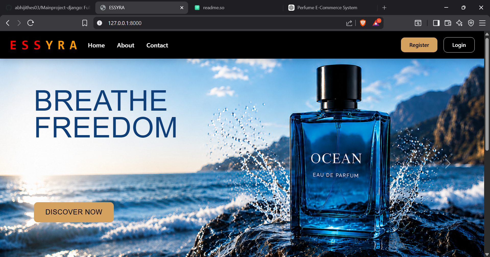
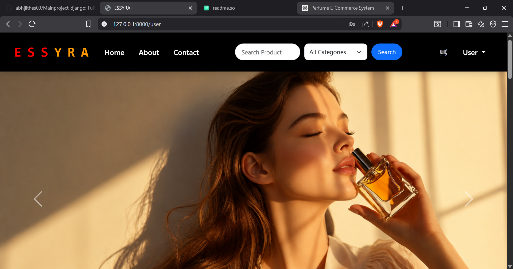
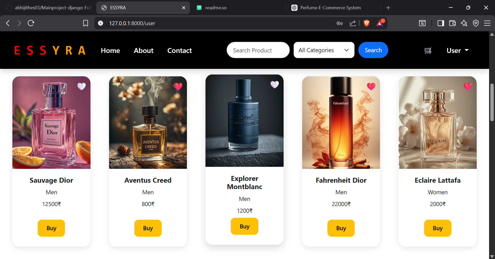
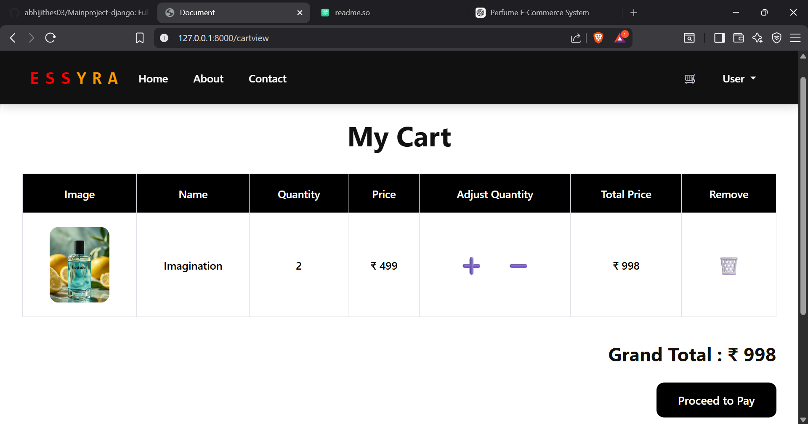
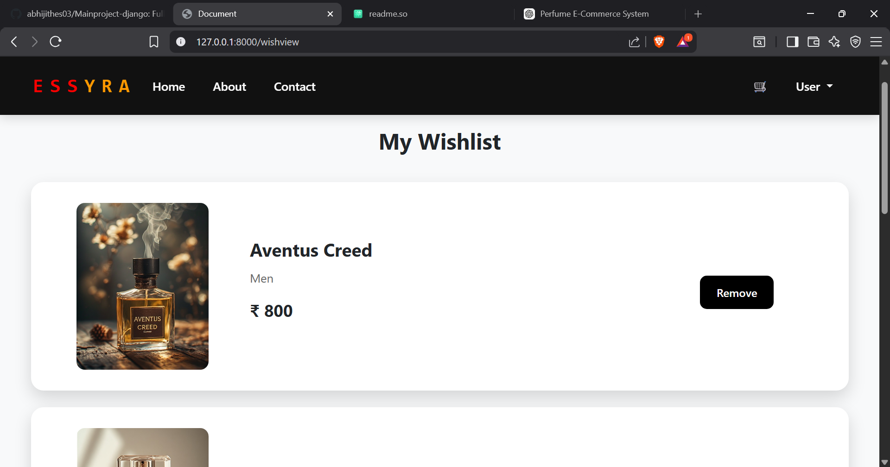
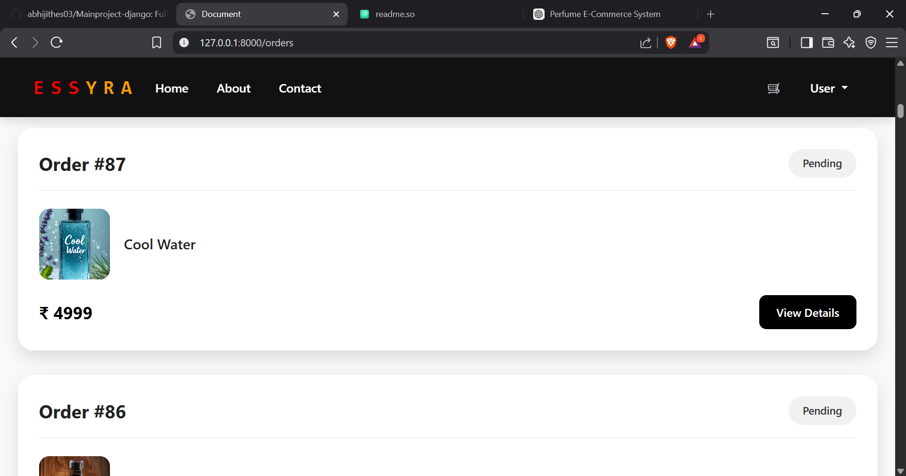
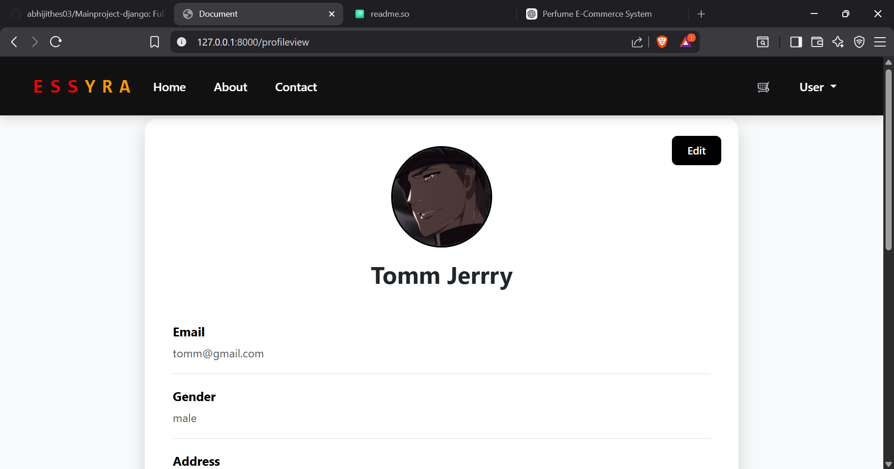

# Perfume E-Commerce Management System

Perfume E-Commerce Management System is a web application built with Django that enables customers to browse and purchase perfumes online. The system includes user authentication, product catalog management, shopping cart, wishlist, order processing, payment integration, inventory tracking, reviews and ratings, and admin order management.

### Technologies Used

- Python
- Django
- SQLite
- HTML
- CSS
- Bootstrap
- JavaScript
- Stripe Payment Gateway

### Features

- User Registration & Login
- Product Search & Filtering
- Wishlist Management
- Shopping Cart
- Online Payment (Stripe)
- Cash on Delivery
- Order Tracking
- Product Reviews & Ratings
- Inventory Management
- Password Reset via Email
- Admin Dashboard

## Screenshots

Home Page

 

User Home

Prdoucts

Cart

Wishlist

User Orders

User Profile

## Demo

https://github.com/user-attachments/assets/2458922e-a13b-499b-b732-2808a95bb2d2

